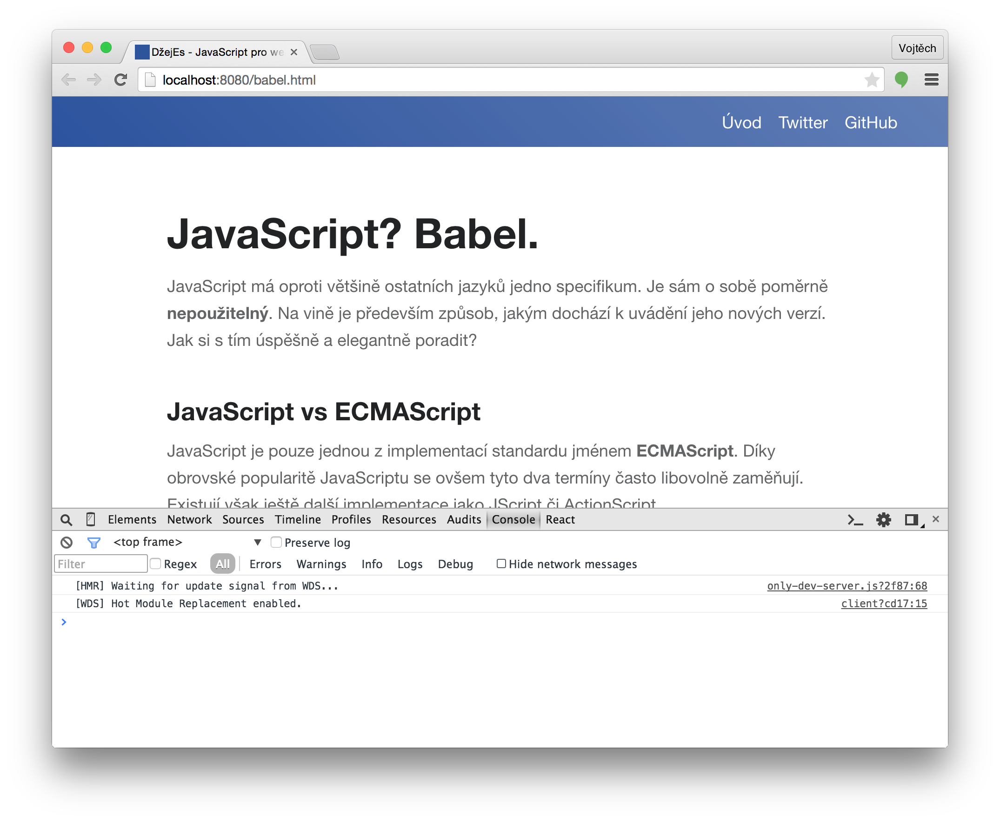

#Nástroje

Tak jako truhlář potřebuje hoblík, pilu nebo nebozez, tak i **vývojář webovek se neobejde bez pořádných nástrojů**. Když si vyberete ty správné a naučíte se s nimi pořádně zacházet, značně usnadní a zrychlí vaši práci. V tomto článku se s nimi v rychlosti seznámíme.

##Operační systém

Vezmeme to pěkně od základu a tím je operační systém. Nemá smysl chodit kolem horké kaše. Sami asi tušíte, že tím **slonem v místnosti je Windows**. Budete s ním pravděpodobně narážet na různé problémy (pramenící z node.js, npm, slabší podpory Facebooku v jeho opensource knihovnách...), které byste na OSX nebo Linuxu nikdy řešit nemuseli. Předem se tak omlouvám, pokud vám občas něco nebude fungovat. **Články totiž primárně počítají s OSX (či Linuxem)**. Budu ovšem moc rád, pokud případné opravy či návody pošlete pull requestem.

##Prohlížeč

**Standardem pro vývoj je Google Chrome**, který má dnes asi nejpropracovanější vývojářské nástroje. Otevřete je zkratkou `⌘`+`alt`+`j`. **Vůbec nejdůležitějším panelem je `Console`**. Mějte ho pořád na očích. JavaScript vám do něj bude vypisovat všechny warningy a errory. Také si do něj můžete logovat hodnoty vlastní pomocí funkce `console.log(...)`, která přehledně vypíše i komplikované datové struktury, což je fajn pro rychlé ladění.

Druhým nejužitečnějším panelem je `Elements`. **Můžete v něm procházet a hlavně upravovat aktuální DOM strukturu a kaskádové styly.** Změny se pak okamžitě projeví v okně prohlížeče. Hodí se třeba i pro ujištění, zda vám JavaScript vyrendroval nějakou komponentu a není třeba jen schovaná kvůli špatnému stylování.

<p class="pic-container">
  
</p>

Další panely už budete používat asi méně. Velmi šikovný je `Networks`, ve kterém si můžete přehledně například vyfiltrovat XHR requesty. V `Sources` pak můžete debugovat pomocí breakpointů. Doinstalovat si můžete i speciální [panel pro React](https://chrome.google.com/webstore/detail/react-developer-tools/fmkadmapgofadopljbjfkapdkoienihi?hl=en). Je podobný `Elements`, ale poskytuje i informace o stavu React komponent. Nicméně reálně ho moc nepoužívám.

V nastavení vývojářských nástroju si ještě zkontrolujte, že máte zaškrtnuté `Enable CSS source maps` a `Enable JavaScript source maps`. V našich projektech nebudeme používat přímo JavaScript, ale Babel, který se do něho překládá. **Source mapa pak umožní prohlížeči namapovat řádky výsledného JavaScriptu na zdrojový Babel** a my se tak dozvíme správný řádek a soubor, kde došlo k chybě. Obdobně to funguje pro CSS a preprocesory jako je LESS.

Web nakonec musíte samozřejmě pravidelně testovat i v ostatních prohlížečích. I ty mají vlastní vývojařské nástroje. Pokud se vám tedy stane, že vám něco nefunguje pouze ve Firefoxu, nebojte se je vyzkoušet. Jsou velmi podobné těm v Chromu.

##Sublime Text

Zatímco mezi webovými prohlížeči moc na výběr nemáte, **o dobré textové editory není nouze**. Nemá smysl zde dělat nějaké dogmatické závěry. Někomu bude vyhovovat spartánský VIM a někdo má zase rád velké všeobjímající IDE. I tak se mezi JavaScriptovými vývojáři dá vypozorovat několik oblíbenců. **Jedním z nich je editor [Sublime Text](http://www.sublimetext.com/).** Momentálně ho používám jako svůj hlavní editor pro všechno.

Jeho největší předností je rychlost, jednoduchost, spolehlivost a obrovská paleta všemožných doplňků. Nevýhodou pak je to, že se jedná o one-man show projekt, který autor trochu zanedbává, nicméně nedávno se mu zas začal věnovat. Jak už to bývá, dobré věci nejsou zadarmo a tak vás licence vyjde na rozumných $70. Lze ho však nějaký čas používat a zkoušet zdarma. Nejvíce ho totiž oceníte až po nějaké době, kdy si zapamatujete různé zkratky a využijete tak jeho maximální potenciál.

Pokud se ho rozhodnete používat pro vývoj webovek, doporučuji si pro začátek [stáhnout a nainstalovat](https://packagecontrol.io/installation) tyto doplňky:

* [All Autocomplete](https://github.com/alienhard/SublimeAllAutocomplete)
* [AutoFileName](https://github.com/BoundInCode/AutoFileName)
* [Babel](https://github.com/babel/babel-sublime)
* [EditorConfig](https://github.com/sindresorhus/editorconfig-sublime)
* [Focus File On Sidebar](https://github.com/miguelgraz/FocusFileOnSidebar)
* [Git](https://github.com/kemayo/sublime-text-git)
* [Sidebar Enhancements](https://github.com/titoBouzout/SideBarEnhancements)
* [Sublime Linter](https://github.com/SublimeLinter/SublimeLinter3)

V některém z dalším článku popíšu, jak a proč si nastavit ESLint neboli kontrolu kódu pro JavaScript (Babel) a JSX přímo v Sublime Textu.

<p class="pic-container">
  
</p>

**Dalším editorem, který stojí za pozornost je [Atom](https://atom.io/)**. Je to open source projekt, za kterým stojí GitHub a velmi připomíná Sublime Text. Má ale jeden problém a to je stabilita. Není zatím tak "uhlazený" jako ST a to je u nástroje, který používáte prakticky pořád, dost nepříjemné. Čas od času ho i přesto zkouším a jsou tam vidět velké pokroky. Také nad ním vznikají nové nástavby jako je [Visual Studio Code](https://code.visualstudio.com/) od Microsoftu nebo [Nuclide](http://nuclide.io/) od Facebooku. Budoucnost Atomu vypadá zajímavě.

Hodně přívrženců pak má i [WebStorm](https://www.jetbrains.com/webstorm/), [PHPStorm](https://www.jetbrains.com/phpstorm/) a celá rodina editorů postavená nad IntelliJ. **Pokud máte rádi velké plnohodnotné IDE, které už v základu lecos umí, tak rozhodně stojí za zkoušku**. Na psaní kódu se dá ale používat prakticky cokoliv, takže se nebojte experimentovat.

##Terminál

Svatou trojici pak uzavírá terminál. **Prohlížeč, textový editor a terminál jsou tři věci, které musíte mít jako vývojář stále na očích**. Kromě základní práce se soubory a Gitem z něho budete spouštět vývojový server, buildovat produkční verze a sledovat případné warningy a errory v kódu. Obzvlášť s používáním hot reloadu se většina hlášení bude objevovat právě zde a nikoliv v Console logu prohlížeče.

<p class="pic-container">
  
</p>

##Node.js a Npm

O [node.js](https://nodejs.org/) jste už určitě všichni slyšeli. Jistého chytrého člověka napadlo vzít JavaScript runtime z Chromu a postavit nad ním velmi výkonnou platformu, která by se dala používat i mimo prohlížeč a to zejména na serverech. Tento nápad se setkal s obrovským ohlasem a pomohl odstartovat to pravé JavaScriptové šílenství.

Asi není překvapivé, že **node se tak stává přirozenou volbou (nejen) pro aplikace, které závisí na velkém JS frontendu**. Je totiž velmi výhodné používat stejný jazyk na obou březích. Můžete tak snadno sdílet části kódu (například validační pravidla či routing), či si předrendrovat stránku už na serveru a uživateli poslat rovnou hotové HTML. Navíc i pokud se rozhodnete stavět server nad jinou platformou, tak se nodu nevyhnete kvůli vývojářským nástrojům, které jsou téměř výhradně napsané také v JavaScriptu. **Takže si ho prosím rovnou nainstalujte**.

<p class="pic-container" style="max-width: 300px">
  
</p>

**S nodem se vám nainstaluje i [npm](https://www.npmjs.com/) - balíčkovací manager**. Jde o ultimátní a jednotné řešení pro sdílení kódů napříč JS ekosystémem. Původně byl určen pro prostředí nodu, ale nakonec se z něj stal i jednotný systém pro frontend vývojáře (R.I.P [bower](http://bower.io/)). Používá ho tak node, browserify, webpack, gulp, grunt, Angular, jQuery, React, prohlížeče ... prostě všichni.

**Největší předností a odlišností NPM (například od Boweru) je to, že každý balíček může mít své vlastní závislosti (balíčky)**. Vzniká tak strom závislostí a není problém, aby v jednom projektu běžela jedna knihovna v několika verzích. Tedy, občas to problém být může. Například React bude dost nešťastný, pokud bude muset o správu DOMu bojovat s další instancí Reactu. Aneb vůči dependency hellu není a nebude zcela imunní žádný balíčkovací manager, ale NPM si v porovnání s konkurencí vede víc než obstojně. **Dalším fundamentálním rysem je filosofie malých a jednoúčelových balíčků**. Není tedy nic zvláštního, pokud je balíček pouze jedna několikařádková funkce.

##Grunt

**Se vší tou záplavou růných nástrojů, kompilátorů a linterů je potřeba se nějak vypořádat**. Představte si, že byste po každé změně kódu museli vlézt do terminálu, najít změněný soubor, spustit nad ním Babel, poté ESLint a pak v prohlížeči ještě udělat refresh. To je přeci repetativní úkon, který se může zautomatizovat. **Objevily se tak nástroje označované jako "task runnery"**. Velmi populárním byl (a stále je?) [Grunt](http://gruntjs.com/). Do projektu si přidáte `Gruntfile`, ve kterém si vše můžete nakonfigurovat. Konfigurace se skládá z jednotlivých tasků, které můžete pak volat v různém pořadí. Jednotlivé tasky (moduly) nemusíte psát sami, ale většinou je už najdete hotové na NPM. Jsou jich tisíce. Výsledek může vypadat třeba takto:

```js
module.exports = function(grunt) {

  grunt.initConfig({
    jshint: {
      files: ['Gruntfile.js', 'src/**/*.js', 'test/**/*.js'],
      options: {
        globals: {
          jQuery: true
        }
      }
    },
    watch: {
      files: ['<%= jshint.files %>'],
      tasks: ['jshint']
    }
  });

  grunt.loadNpmTasks('grunt-contrib-jshint');
  grunt.loadNpmTasks('grunt-contrib-watch');

  grunt.registerTask('default', ['jshint']);

};
```

**Postupně se však ukázalo, že cesta "vše konfigurovat" není úplně nejšťastnější**. Bez dokumentace totiž nedáte ani ránu a pokud si nevystačíte s předem danými funkcemi, tak máte problém. **Dalším problémem Gruntu je rychlost**. Mezivýsledky si totiž ukládá do filesystému a u větších projektů s komplikovaným build procesem trvá dlouho (tohle už možná nejnovější verze nějak řeší).

##Gulp

**A tak přibyl mladší bráška [Gulp](http://gulpjs.com/), který se ponaučil z Gruntu a jde na to lépe**. Konfigurace aka `Gulpfile` je JavaScript. **Místo toho, abyste konfigurovali, tak programujete**, což je velmi flexibilní a také odpadá nutnost spoléhat na dokumentace. Dalším zlepšovákem jsou streamy, které Gulp používá. Mezivýsledky si drží v paměti, vše běží paralelně a především citelně rychleji. Občas je však problém zkrotit tasky tak, aby běžely sekvenčně (verze 4.x tento častý problém adresuje). Tak jako Grunt i Gulp má dnes již téměř nekonečné množství pluginů. **Grunt vs Gulp? Rozhodně Gulp**. Pro názornost, "konfigurace" Gulpu může vypada třeba takto:

```js
var gulp = require('gulp');
var coffee = require('gulp-coffee');
var concat = require('gulp-concat');
var uglify = require('gulp-uglify');
var imagemin = require('gulp-imagemin');
var sourcemaps = require('gulp-sourcemaps');
var del = require('del');

var paths = {
  scripts: ['client/js/**/*.coffee', '!client/external/**/*.coffee'],
  images: 'client/img/**/*'
};

// Not all tasks need to use streams
// A gulpfile is just another node program and you can use all packages available on npm
gulp.task('clean', function(cb) {
  // You can use multiple globbing patterns as you would with `gulp.src`
  del(['build'], cb);
});

gulp.task('scripts', ['clean'], function() {
  // Minify and copy all JavaScript (except vendor scripts)
  // with sourcemaps all the way down
  return gulp.src(paths.scripts)
    .pipe(sourcemaps.init())
      .pipe(coffee())
      .pipe(uglify())
      .pipe(concat('all.min.js'))
    .pipe(sourcemaps.write())
    .pipe(gulp.dest('build/js'));
});

// Copy all static images
gulp.task('images', ['clean'], function() {
  return gulp.src(paths.images)
    // Pass in options to the task
    .pipe(imagemin({optimizationLevel: 5}))
    .pipe(gulp.dest('build/img'));
});

// Rerun the task when a file changes
gulp.task('watch', function() {
  gulp.watch(paths.scripts, ['scripts']);
  gulp.watch(paths.images, ['images']);
});

// The default task (called when you run `gulp` from cli)
gulp.task('default', ['watch', 'scripts', 'images']);
```

Podrobnější porovnání Gulpu a Gruntu můžete najít i v [pěkném článků na Zdrojáku](http://www.zdrojak.cz/clanky/gulp-vs-grunt-souboj-bez-viteze-a-porazeneho/).

##Browserify

Node.js zavedlo do světa JS snadný způsob jak kód modularizovat. Takový modulární systém potřebuje dvě primární věci: možnost exportovat a importovat. Výše jste si mohli již povšimnout importování:

```js
var gulp = require('gulp');
```

Obdobný zápis v ES6:

```js
import gulp from 'gulp';
```


Výše uvedené zkusí prohledat `/node_modules` ve vašem projektu - místo, kam se vám budou ukládat balíčky z npm. Stačí zavolat `npm install gulp --save` a máte ho tam. Přepínač `--save` ho navíc přidá do seznamu v `package.json`. Běžně se totiž `/node_modules` adresář v Gitu ignoruje a tak je někde potřeba uchovávat seznam všech závislostí.

V `/node_modules/gulp` se pak import podívá do hlavního souboru daného balíčku a v něm najde export:

```js
var inst = new Gulp();
module.exports = inst;
```

**To je vše pěkné, ale asi vás teď napadlo, jak to bude fungovat v prohlížeči? Nebude.** Do prohlížeče můžeme jednotlivé skripty nahrávat pomocí `<script> ... </script>`, ale to nám moc nepomůže. Podobných souborů totiž budeme mít v projektu stovky až tisíce a posílat tolik HTTP requestů rozhodně nemůžeme. **Také to nijak neřeší potřebu verzování, minimalizování a zapouzdřování**. Tyto závislosti je tedy potřeba vyřešit už před releasem a uživateli posílat jeden výsledný soubor, ve kterém bude jen to, co skutečně potřebuje.

<p class="pic-container" style="max-width: 250px">
  
</p>

**A tak vzniklo [Browserify](http://browserify.org/)**. Vezme váš kód a vyřeší všechny `require` a `module.exports` a vyplivne jeden výsledný soubor. **JavaScript, který byl původně určen pro node.js, dokáže udělat kompatibilní pro prohlížeče**. Poradí si například i s core node.js knihovnami. Nicméně to má samozřejmě jistá omezení. Například nemůžete pracovat s `fs` (filesystem). Velkým plusem je, že není potřeba nic konfigurovat - jednoduše to bude fungovat. Všechna magie se děje uvnitř. Ne nadarmo má ve znaku kouzelnický klobouk.

##Webpack

**Browserify funguje opravdu pěkně, ale i tak má přeci jen pár mušek**. Řeší totiž jenom JavaScript a vše ostatní je potřeba doplnit spoustou gulp modulů. Navíc se ukázalo, že **kromě JavaScriptu je potřeba podobně zpracovat i CSS** (v praxi například LESS) nebo obrázky. To by nemuselo s Gulpem a jeho tisíci pluginy vadit, že? Bohužel Gulp má jednu zásadní slabinu, která plyne ze streamování. Neumí úplně přímočaře vytvořit z několika souborů jeden výstupní (s tím se umí lépe vypořádat např. undergroundovější task runner [Broccoli](http://broccolijs.com/)). Je tak potřeba v gulp tascích řešit trochu nešikovně bundlování. A z toho zase mohou vznikat další obtíže, jako je správné odchytávání a zobrazování chyb. Dá se s tím poprat, ale budete cítit, že to není úplně ono.

**[Webpack](http://webpack.github.io/) na to jde úplně jinak, tak trochu proti filosofii celého JS ekosystému**. Nedeleguje a nevyčleňuje jednotlivé funkce do více modulů a tak už v základu představuje velmi mocný nástroj. Nástroj, který byl od počátku zamýšlen tak, aby nám vývojářům co nejvíce usnadnil práci. **Základním stavebním kamenem jsou loadery**. Každý formát má vlastní a může jít téměř o cokoliv (.js, .css, .less, .coffee, .png...). Webpack pak přetíží `require()` volání a můžete ho použít třeba i pro markdown dokumenty (jako tato stránka). Následně pak funguje podobně jako browserify, tedy vyřeší závislosti a sestaví build, ve kterém je jen to potřebné.

<p class="pic-container">
  
</p>

**Oproti browserify je potřeba ho nakonfigurovat, což není úplně jednoduché**. Na druhou stranu, jakmile to jednou uděláte, získáte velmi mocného společníka. Konfiguraci navíc můžete z velké části obšlehnout. **Poskytuje také jednu killer funkci**, kterou browserify nemá a pro kterou se vyplatí na něj z browserify přejít a tím je **hot module replacement**. Dokáže nahradit a zpracovat modul, aniž by bylo potřeba refreshovat celou stránku (a modul může být javascript, less nebo markdown!). Bez jakýchkoliv dodatečných pluginů v prohlížeči. Pouze čistý JavaScript! To ohromně zefektivňuje vývoj.

Dobré je také zmínit, že **kdykoliv můžete velmi snadno přejít z browserify na webpack** (bez úprav zdrojáků). Udělal jsem to nedávno u projektu s 10 000 řádky kódu a 70 npm moduly bez jediné upravy mimo konfiguraci webpacku a gulpu. Naopak už to vždy jít nemusí (pokud například budete specifikovat loadery inline přímo v require voláních).

##ESLint

**Lintování je levný způsob, jak zlepšit stav zdrojáků napříč větším projektem či týmem několika programátorů**. Hlídá totiž styl, jakým kód píšete a tak musí všichni stejně odsazovovat nebo používat závorky. **Pravidla, podle kterých se řídí, si samozřejmě můžete libovolně nastavit**. Nebude vám podstrkovat nějaký svůj styl. Krom toho, že hlídá úhlednost a jednotnost kódu, tak vám leckdy pomůže odhalit i různé překlepy či nepoužíváné importy. [ESLint](http://eslint.org/) je poměrně nový JS linter (2013), který si vzal ponaučení z JSHintu a je kompletně modulární. Můžete si do něj tedy přidávat různé doplňky. **Například se vám bude jistě hodit podpora React JSX či Babelu**. Lintování si můžete nainstalovat přímo do svého editoru a zároveň ho přidat i do build procesu, což je taková případná obrana před vývojářem, který by se rozhodl pravidla porušit.

##Závěrem

Tento článek byl především seznamovací a většina z vás v něm asi nenalezla mnoho nového. I tak je ale důležité udělat alespoň rychlý přehled o různých nástrojích a technologiích, které se dnes používají. **V JS světě se budete neustále potýkat s tím, že žádná řešení nejsou ultimátní** a i ta, která jsou zrovna na špici, mohou za půl roku upadnout zcela v zapomnění. A tak tu máme několik kvalitních prohlížečů, editorů, task runnerů, bundlerů, linterů a dokonce i "JavaScript jazyků".

Ale nebojte, příště už to bude rozhodně zajímavější! Vyhrneme si rukávy a pustíme se konečně do práce. **Ukážeme si, jak to vše poskládat dohromady a napíšeme si první React komponentu!**
