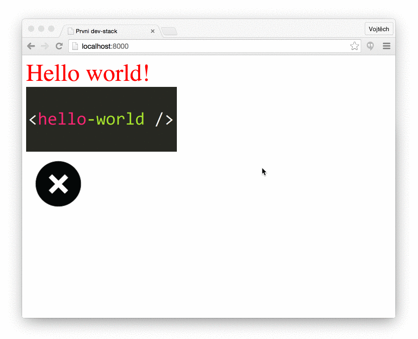

#První dev stack

Hlavním hrdinou dnešního článku se stane bundlovací nástroj webpack. Lecos jste se o něm mohli dozvědět už v [minulém článku](nastroje.html). S jeho pomocí postavíme první jednoduchou "Hello world" aplikaci v Reactu, která bude například používat Babel (JavaScript budoucnosti) a LESS (CSS preprocesor). **Ukážeme si sílu moderních JS nástrojů v praxi**.

##Výsledek

Protože určitě nemáte rádi překvapení, tak vám hned v úvodu ukážu k čemu se na konci tohoto článku dopracujeme. Výsledkem bude triviální 100% JavaScriptová aplikace s jedinou React komponentou. Jakékoliv úpravy v ní, či přiloženém LESSu se po uložení v editoru **okamžitě** projeví na stránce. **Bez refreshnutí, prosím pěkně!** Kompletní zdrojové kódy najdete v [samostatném repozitáři na GitHubu](https://github.com/tajo/devstack).

<p class="pic-container" style="max-width:630px">
  
</p>


##Očekávání

Doufám, že se vám demo líbilo. Na první pohled se možná nezdá jako kdoví co, ale vězte, že pod jeho pokličkou toho bublá daleko více. Běží totiž na moderním JS dev stacku, což je soubor různých knihoven, technik a nastavení. Je to základová deska pro náš rodinný baráček. Avšak s menší úpravou by zvládla unést i velký hrad. Co tedy od ní čekat? Jaké jsou naše požadavky?

**Chceme:**
- **programovat v Babelu**, protože [je to lepší JavaScript](babel.html)
- budovat velkou a škálovatelnou aplikaci → **chceme maximální modularitu**
- mít možnost jednoduše integrovat a **používat stovky tisíce balíčků z npm**
- používat nějaký šikovný **CSS preprocesor**, třeba LESS, do budoucna pak možná [postprocesor](http://www.zdrojak.cz/clanky/smeruje-css-od-preprocesingu-k-postprocesingu/)
- po každé změně v JS i CSS **ihned vidět výsledek v prohlížeči**, ideálně bez refreshnutí
- mít **2 módy**: vývojový a produkční
- v produkčním módu všechny potřebné JS soubory (moduly) **sloučit do jednoho a minimalizovat**, obdobně i pro kaskádové styly
- v produkčním módu ignorovat warningy a jiné debugovací výpisy
- mít **kód kontrolovaný linterem**, aby zůstal pěkný a jednotný
- aby po prvotním nastavení **všechno fungovalo automaticky**
- **jednoduchost!**

Dlouhý a náročný seznam? Ale kdeže. Jsme programátoři, náš čas je extrémně drahý a menší investice do ladění vývojářského procesu se nám mnohonásobně vrátí. Navíc to sfoukneme raz dva!

<p class="pic-container" style="max-width:534px">
  
</p>

Stack pro tento článek jsem si samozřejmě nevycucal z prstu, ale inspiroval se z mnoha jiných. Mým cílem bylo postavit něco, co bude maximálně jednoduché a přesto použitelné pro reálnou aplikaci. Neobsahuje například React-router, Redux či Immutable.js. Jsou to výborné knihovny a vřele doporučuji je prozkoumat, ale pro začátek nejsou potřeba. Řeší totiž problémy, které vyvstávají až u velkých aplikací. Pokud přesto máte chuť a odvahu jít do toho "all-in", zkuste například [github.com/este/este](https://github.com/este/este).

##Webpack

Už jsem o něm básnil v [předchozím článku](nastroje.html). Pro jeho docenění je nejdříve potřeba pojmenovat zásadní problém, kterému vývojáři webových aplikací čelí. Naše aplikace (zdrojové kódy) jsou distribuovány pomocí pomalého a nespolehlivého protokolu HTTP do vzdáleného prohlížeče. Tam se musí ihned zparsovat, spustit a něco provést. Velikost naší aplikace je tedy velmi limitovaná, pokud nechceme uživatele ztratit nekonečnou bílou stránkou. **Aby vše fungovalo svižně, musíme co nejvíce omezit počet HTTP requestů a minimalizovat jejich velikost.**

<p class="pic-container" style="max-width:334px">
  
</p>

Jinými slovy **musíme velmi pečlivě zvážit, co a kdy do prohlížeče posílat a po jakých částech**. U spousty aplikací nám bude stačit to, když všechny naše skripty spojíme do jednoho souboru `bundle.js`. Ovšem takový soubor může časem nepřijemně nabobtnat. Jak to vyřešit? Každá část (stránka) naší aplikace potřebuje pravděpodobně různé skripty a tak můžeme dle URL adresy posílat speciální menší bundly, kde bude jen to, co daná stránka skutečně potřebuje. Kód, který používají všechny stránky (typicky knihovna jako jQuery či React), pak dáme do  `<script src="common.js">`, který bude všude - využijeme tak cache prohlížeče. **To samé můžeme udělat s CSS**. Obrázky pak můžeme vhodně cacheovat (verzovat) a ty, které mají jen pár kB, rovnou vložit zakódované do HTML jako base64 - ušetříme tak další drahocenné requesty. **To zní jako hodně otravné práce, že?**

Ano, to je hodně práce! Naštěstí existuje geniální webpack, který tohle vše dokáže vyřešit za nás. Jediné co musíme udělat my je **explicitní uvádění závislostí**. V hantýrce ES6 jde o `import`, v ES5 pak o `require`. U našich JS modulů to dělat musíme tak jako tak, ale ta převratná myšlenka webpacku spočívá v tom, že úplně stejným způsobem **budeme uvádět (importovat) i CSS, obrázky, fonty** a vlastně úplně cokoliv co daná stránka / komponenta / balíček potřebuje ke svému životu.

Webpack pak projde všechny soubory (importy) a sestaví komplexní graf závislostí. Ještě mu musíme ukázat, kde začít, co ignorovat, čím jednotlivé formáty zpracovat (loadery) a jaký od něho očekáváme výstup (jeden velký bundle, více menších bundlů ...). **Výstup pak bude 100% optimální**. Každá část aplikace dostane "na cestu" jen to co skutečně potřebuje a nic zbytečně navíc. Hurá!

**Webpack má obsáhlou [dokumentaci](http://webpack.github.io/docs/)**, která je ale trochu nepřehledná. Můžete také nahlédnout do [hezkého shrnutí](https://github.com/petehunt/webpack-howto) od Pete Hunta. Webpack je velký a mocný nástroj, který je zároveň i extrémně modulární díky loaderům a pluginům. **Není však úplně snadné ho nastavit**.

##Hot module replacement

V roce 2015 měl velkou slávu hot reloading. Jde o další skvělou funkci webpacku (dnes už je i nějaká podpora v browserify). Slouží čistě vývojářům během vývoje aplikace. **Je to cesta, kterou je možné vyměňovat, přidávat a mazat moduly již v běžící aplikaci. Změny se pak na stránce projeví okamžitě bez refreshe.**

Proč je to tak převratné? **Ohromně to zrychluje a zpříjemňuje vývoj**. Refresh je nejen pomalý ale hlavně se při něm ztrácí stav aplikace. Například rozepsaný formulář nebo posloupnost kroků, kterou jste se dostali do nějaké skryté části aplikace (nedostupné přes URL).

Jak tahle magie funguje? Webpack-dev-server si pomocí socketů povídá s webpack runtime (přiložený bundle k hlavnímu skriptu stránky) a oznámí mu, když uložíte (aktualizujete) nějaký soubor. **Webpack runtime se pak zeptá původního starého modulu, jestli umí zpracovat aktualizaci**, pokud ne, tak jde tato výzva stromem závislostí výše. Pokud se nenajde nikdo, kdo by aktualizaci dokázal provést, tak vám webpack v konzoli suše oznámí, že je potřeba udělat klasický refresh. Musíme psát ke každému modulu potenciálně velmi komplikovanou accept metodu?

Ano i ne. **U React komponent je potřeba vždy přerenderovat celý strom**. Obecným dobrým trendem je udržovat stav aplikace mimo React komponenty (Redux) a tudíž tento postup funguje. Komponenty sice vždycky kompletně přerenderujeme, ale jelikož v nich není žádný stav, na stránce se vlastně nic nezmění (neztratí). Ovšem ne každý používá striktně Redux a tak vzniklo magické řešení plné hacků aka React Hot Loader, které se snaží stav v komponentách během přerenderování udržet, což ne vždy funguje. Pokud vás zajímá více detailů, přečtěte si [výborný článek](https://medium.com/@dan_abramov/hot-reloading-in-react-1140438583bf#.90dg96b0m) od autora React Hot Loaderu Dana Abramova. **TLDR;** pokud budete používat Redux, tak žádné hacky vůbec nepotřebujete, jinak si počkejte na RHL v3, který je sice pořád komplexní, ale už ne tolik magický a více funkční.

##Struktura aplikace

```
devstack/                        ← hlavní adresář
  ├── build/                     ← produkční (vybuildněná) verze
  ├── node_modules/              ← NPM balíčky (závislosti projektu)
  ├── src/                       ← zdrojové kódy
  │   ├── client/                ← front-end (FE) / prohlížečová část
  │   │   └── hello.gif          ← velký obrázek (>10kB)
  │   │   └── icon.png           ← malý obrázek (<10kB)
  │   │   └── index.js           ← hlavní (vstupní) soubor FE části
  │   │   └── main.js            ← hlavní root React komponenta
  │   │   └── main.less          ← CSS styly pro hlavní komponentu
  │   ├── server/                ← serverová část (node.js)
  │   │   └── html.js            ← komponenta se strukturou HTML stránky
  │   │   └── index.js           ← babel require hook
  │   │   └── main.js            ← HTTP (express) server
  ├── webpack/                   ← nastavení webpacku
  │   └── config.dev.babel.js    ← webpack konfig pro vývojový režim
  │   └── config.prod.babel.js   ← webpack konfig pro produkční verzi
  │   └── constants.js           ← konstanty, cesty
  │   └── index.js               ← babel require hook
  │   └── server.dev.js          ← vývojový server webpacku
  ├── .babelrc                   ← konfigurace babelu (pro server)
  ├── .eslintrc                  ← konfigurace eslintu
  ├── .gitignore                 ← soubory ignorované gitem
  ├── .travis.yml                ← nastavení CI
  ├── LICENSE                    ← licence
  ├── README.md                  ← základní info (v angličtině)
  └── package.json               ← rodokomnen aplikace, závislosti atd.
```

Obsah souboru `package.json`:

```
{
  "name": "devstack",
  "description": "Simple devstack for modern JS apps",
  "author": "Vojtech Miksu <vojtech@miksu.cz>",
  "version": "1.0.0",
  "private": true,
  "scripts": {
    "clean": "rm -rf build",
    "start": "node webpack/index | NODE_ENV=development node src/server",
    "build": "npm run clean && NODE_ENV=production webpack --config webpack/config.prod.babel.js",
    "server": "NODE_ENV=production node src/server",
    "lint": "eslint src webpack || true"
  },
  "dependencies": {
    "babel-core": "^6.8.0",
    "babel-eslint": "^6.0.4",
    "babel-loader": "^6.2.4",
    "babel-plugin-transform-runtime": "^6.8.0",
    "babel-preset-es2015": "^6.6.0",
    "babel-preset-node6": "^11.0.0",
    "babel-preset-react": "^6.5.0",
    "babel-register": "^6.8.0",
    "babel-runtime": "^6.6.1",
    "compression": "^1.6.1",
    "css-loader": "^0.23.0",
    "eslint": "^2.9.0",
    "eslint-config-airbnb": "^9.0.1",
    "eslint-loader": "^1.3.0",
    "eslint-plugin-import": "^1.8.0",
    "eslint-plugin-jsx-a11y": "^1.2.0",
    "eslint-plugin-react": "^5.1.1",
    "express": "^4.13.4",
    "extract-text-webpack-plugin": "^1.0.1",
    "file-loader": "^0.8.1",
    "ip": "^1.1.3",
    "less": "^2.5.1",
    "less-loader": "^2.0.0",
    "react": "^15.0.2",
    "react-dom": "^15.0.2",
    "style-loader": "^0.13.1",
    "url-loader": "^0.5.5",
    "webpack": "^1.12.14",
    "webpack-dev-middleware": "^1.6.0",
    "webpack-hot-middleware": "^2.10.0"
  }
}
```

Po jeho uložení zavolejte:

```
npm install
```

Všechny potřebné závislosti se vám tímto nainstalují do `node_modules/`.


##Server

I přesto, že **naše aplikace a veškerá její logika může kompletně běžet pouze v prohlížeči, pořád nám jí někdo musí do toho prohlížeče naservírovat**. Potřebujeme server. Pro to úplně nejjednodušší použití potřebujeme od serveru to, aby nám vrátil základní HTML strukturu s prázdným `<body />` a naší JS aplikací `<script src="build/bundle.js">`. Dále ještě potřebujeme, aby se ve vývojovém módu nahradil hotový `build/bundle.js` za webpack-dev-server `<script src="//localhost:8888/build/app.js">`.

**Takový server může být v PHP, Pythonu, Javě či vašem oblíbeném jazyce XXX**. Asi vás úplně nepřekvapí, že my šáhneme opět po JavaScriptu a to **node.js**. Mít prohlížečovou část, serverovou část a nástroje včetně jejich nastavení v jednom jazyce nabízí řadu výhod. Je snadné sdílet stejný kód (router, validace). Lze jednoduše přepínat mezi produkčním a vývojovým režimem. To jsou takové příjemné bonusy. **Pak se nabízí ale i možnost server-side renderování Reactu, kterou už bez node.js nemáte**. Tu však zatím rozebírat nebudeme.

Jelikož se tato série soustředí především na tu prohlížečovou část, tak se samotným nodem moc zabývat prozatím nebudeme. Ostatně existuje už i [český node.js seriál](http://www.zdrojak.cz/clanky/javascript-na-serveru-zaciname-s-node-js/), i když už trochu zastaralý.

Hlavní soubor serveru `index.js` vypadá takto:

```js
require('babel/register');
require('./main');
```
Pokud chceme používat Babel v prohlížeči, musíme nejdříve náš kód prohnat Babel kompilátorem a prohlížeči poslat až výsledný JavaScript. V prostředí node.js můžeme udělat to samé. Nicméně díky tomu, že nemusíme řešit spojování modulů, minimalizaci a prohlížeče, tak existují i další možnosti. Například **lze místo node používat [babel-node](https://babeljs.io/docs/usage/cli/#babel-node)**. Pro spuštění serveru pak použijete příkaz `babel-node index` místo `node index`. Další a **elegantní možností je výše použitý [require hook](https://babeljs.io/docs/usage/require/) `require('babel/register')`**. Babel se nabinduje na nodí require a bude kompilovat soubory za běhu (počínaje `./main.js`). Šestá verze node.js je už téměř plně kompatibilní s ES2015. Bohužel pořád chybí podpora ES2015 modulů a tak je stále Babel ještě potřeba. Nimcéně stačí použít minimalistický `babel-preset-node6`. Pokud chcete použít starší verzi Node, je potřeba příslušný preset, který doplňuje více chybějících funkcí.

Soubor `main.js` je už zajímavější:

```js

import React from 'react';
import ReactDOMServer from 'react-dom/server';
import express from 'express';
import compression from 'compression';
import Html from './html';

const app = express();
const port = process.env.PORT || 8000;

app.use(compression());
app.use('/build', express.static('build'));

app.get('*', (req, res) => {
  res.send(`<!DOCTYPE html>${ReactDOMServer.renderToStaticMarkup(<Html />)}`);
});

app.listen(port);
console.log(`Server started on port ${port}`); // eslint-disable-line
```

**Představuje totiž celý server**. Nepotřebujeme už Apache či Nginx, protože node umí obstarat HTTP komunikaci sám. Express je nejpoužívanější node framework, se kterým je hračka napsat například jakékoliv API.

**Nám stačí pouze jedno pravidlo**. V metodě `app.get` říkáme, že na jakoukoliv adresu nám má server poslat daný řetězec, který reprezentuje naší prázdnou HTML stránku. Tedy krom adresáře `/build`, ve kterém budeme mít naše JS/CSS bundly či obrázky.

Trošku jsem v úvodu lhal o té jediné React komponentě. Tady je totiž druhá s názvem `Html`. **`ReactDOMServer.renderToStaticMarkup` vrátí DOM v podobě prostého řetězce**.

Poslední dílek skládanky je samotná struktura stránky v Reactu `html.js`:

```js
import React from 'react';
import path from 'path';
import fs from 'fs';

const isProduction = process.env.NODE_ENV === 'production';
const buildDir = isProduction ? fs.readdirSync(path.resolve(__dirname, '../../build')) : '';
const appJS = isProduction ? buildDir.find(file => /^app\-\w+\.js$/.test(file)) : '';
const appCSS = isProduction ? buildDir.find(file => /^app\-\w+\.css$/.test(file)) : '';
const scripts = isProduction ? `/build/${appJS}` : '//localhost:8080/build/app.js';

export default () => <html>
  <head>
    <meta charSet="utf-8" />
    <title>First dev-stack</title>
    {isProduction && <link href={`/build/${appCSS}`} rel="stylesheet" />}
  </head>
  <body>
    <div id="app-root" />
    <script src={scripts} type="text/javascript" />
  </body>
</html>;
```

**React si více popíšeme až v dalším článku**. Zde jen uvedu, že musíme rozlišovat mezi vývojovým a produkčním režimem. Ve vývojovém nevkládáme CSS soubor pomocí `<link>`, ale děje se tak javascriptovou cestou, aby nám mj. fungoval hot reload pro styly. JavaScript se pak načítá z webpack serveru a adresy `localhost:8080/build/app.js`.

V produkčním režimu se pak klasicky servíruje CSS i JS ze stejného serveru, adresáře `build`. Název souborů se náhodně mění s každým buildem kvůli cacheování. Musíme tedy nejdříve prohledat adresář `build` a soubory najít.

Zbytek je jen prázdná HTML struktura (React komponenta definovaná jako funkce) a `div` s `id="app-root"`, do kterého v prohlížeči vyrendrujeme naši React aplikaci. **Nikdy jí nerendrujte přímo do `body` elementu, jelikož do něj rádi svévolně šahají i různé další knihovny, což pak způsobuje Reactu značný bolehlav**.

Server si nyní můžete pustit příkazem:

```
node index
```

V produkčním režimu pak jako:

```
NODE_ENV=production node index
```

Případně v `package.json` máme script (alias), který lze spustit jako:

```
npm run server
```

Nyní si otevřte Chrome a mrkněte na `http://localhost:8000`. Měli byste tam nalézt velké bíle nic - právě to jsme si totiž zatím vytvořili. Zda jde o dobré nic, zkontrolujte nahlédnutím do zdrojového kódu stránky.

##Front-end

Naše dnešní aplikace bude triviální. Vytvoříme si jedinou React komponentu, která nám vypíše "Hello world!". Také do ní přidáme pár obrázků a styly, abychom si ukázali, jak funguje Webpack. Vstupní bod aplikace index.js vypadá takto:

```js
import React from 'react';
import ReactDOM from 'react-dom';
import Main from './main';

const rootEl = document.getElementById('app-root');
ReactDOM.render(<Main />, rootEl);

if (module.hot) {
  module.hot.accept('./main', () => {
    const NextApp = require('./main').default; // eslint-disable-line
    ReactDOM.render(<NextApp />, rootEl);
  });
}
```

V DOMu si vylovíme div, do kterého pak vyrendrujeme naši jedinou hlavní komponentu `Main`. Děsí vás ty špičaté závorky? Říkáte si, že to není validní JS syntax? Ano, není. **Nicméně Babel dané syntaxi rozumí (JSX) a překládá jí do normálních JS funkcí**. Jediné co musíte pro použití JSX udělat je import Reactu.

Část s `module.hot` je pro účely vývojového režimu. Říkáme zde webpacku, že umíme přijmout změny (hot reload), pokud se něco změní v souboru `./main` či jeho potomcích. Pokud se něco změní, jednoduše znova vyrendrujeme celou aplikaci.

Samotná `Main` komponenta není o moc složitější:

```js
import React from 'react';
import imgHello from './hello.gif';
import imgIcon from './icon.png';
import './main.less';

export default () => <div className="hello">
  Hello world!
  
  
</div>;
```

Povšimněte si, že kromě povinného Reactu **importujeme i soubor s LESS** (stylopis pro naši komponentu s className hello) **a dokonce i obrázky**. Potřeba minimalizace a mazání nepoužívaných CSS je asi všem jasná. **Proč se ale zaobírat obrázky, když ty se nahrávají asynchronně a jen když jsou potřeba i bez nějakého webpacku?**

- Obrázky menší než např. 10kB můžeme automaticky **enkódovat do base64** a vložit přímo do HTML. Tím ušetříme zbytečný HTTP request.
- **Pojmenování**. Webpack obrázky přejmenuje na jejich hash a přesune do společného `/build` adresáře. Prohlížeč je tak může cacheovat "navždy", pokud se změní, tak se změní i jejich název.
- **Lepší struktura a opravdová modularita**. Obrázky totiž můžeme mít přímo u jednotlivých komponent, aniž bychom veřejně odhalovali strukturu naší aplikace. Stejně jako styly a vše ostatní.

Pokud se vám nelíbí představa, že byste museli všechny obrázky uvádět přes import, nezoufejte. Webpack umí poznat a vytáhnout název importu i přímo ze `src=""`, když si to nastavíte pomocí [loader query](http://webpack.github.io/docs/loaders.html#query).

Pro úplnou přehlednost ještě uvedu obsah souboru `main.less`:

```
.hello {
  color: #ff0000;
  font-size: 3em;

  img {
    display: block;
  }
}
```

##NPM scripts

V `package.json` si zadefinujeme jednoduché skripty pomocí kterých budeme spouštět build, linter a vývojový režim. Nejdříve ale ještě musíme doplnit webpack konfiguraci, než budou skripty níže funkční.

```
"clean": "rm -rf build",
"start": "node webpack/index | NODE_ENV=development node src/server",
"build": "npm run clean && NODE_ENV=production webpack --config webpack/config.prod.babel.js",
"server": "NODE_ENV=production node src/server",
"lint": "eslint src webpack || true"
```

Vývojový režim spustíme pomocí příkazů:

```
npm start
open http://localhost:8000
```

Aplikaci vybuildíme a spustíme takto:

```
npm run build
npm run server
open http://localhost:8000
```

Linter:

```
npm run lint
```

Je už na vás, kdy budete linter spouštět v rámci vašeho procesu. Doporučuji si lintování také nainstalovat do vašeho textového editoru, abyste o chybách věděli ihned a gulp task mít jen jako takovou pojistku. Podporovány jsou [všechny běžné editory](http://eslint.org/docs/user-guide/integrations).

##Nastavení Webpacku (vývojový režim)

To nejlepší nakonec. **Dnešní příběh završíme nastavením Webpacku, který naší aplikaci vdechne život**. Vývojový režim se zapíná pomocí `npm start` alias `node webpack/index | NODE_ENV=development node src/server`. Tímto se zároveň spustí webpack dev server (ukážeme si níže) a také náš hlavní server (viz výše).

Webpack dev server nám bude průběžně servírovat JavaScript a styly pomocí websocketů a hot reloadingu. `webpack/index` je opět pouze babel require hook abychom měli plnou podporu ES2015:

```
require('babel-register');
require('./server.dev');
```

Samotný webpack dev server je v `server.dev.js`:

```
import express from 'express';
import webpack from 'webpack';
import webpackDev from 'webpack-dev-middleware';
import webpackHot from 'webpack-hot-middleware';
import configDev from './config.dev.babel';

const app = express();
const compiler = webpack(configDev);

app.use(webpackDev(compiler, {
  publicPath: configDev.output.publicPath,
}));

app.use(webpackHot(compiler));

app.listen(configDev.hotPort, () => {
  console.log('Dev server started at port %d', configDev.hotPort); // eslint-disable-line
});
```

Opět použijeme express. Webpack dev server s hot reloading přidáme jako middleware našeho express serveru. Webpack pak příjímá prvním parametrem konfiguraci, což je jeden velký JS object. V našem případě jde o vývojový konfig `config.dev.babel.js`:

```
import webpack from 'webpack';
import path from 'path';
import ip from 'ip';
import { HOT_RELOAD_PORT, SRC_DIR, BUILD_DIR } from './constants';

export default {
  hotPort: HOT_RELOAD_PORT,
  cache: true,
  debug: true,
  devtool: 'source-map',
  entry: { app: [
    `webpack-hot-middleware/client?path=http://${ip.address()}:${HOT_RELOAD_PORT}/__webpack_hmr`,
    path.join(SRC_DIR, 'client/index.js'),
  ] },
  module: {
    loaders: [{
      loader: 'url-loader?limit=10000',
      test: /\.(gif|jpg|png|woff|woff2|eot|ttf|svg|wav)$/,
    }, {
      test: /\.js$/,
      exclude: /node_modules/,
      loader: 'babel',
      query: {
        plugins: ['transform-runtime'],
        presets: ['es2015', 'react'],
      },
    }, {
      test: /\.less$/,
      loader: 'style-loader!css-loader!less-loader',
    }],
  },
  output: {
    path: BUILD_DIR,
    filename: '[name].js',
    chunkFilename: '[name]-[chunkhash].js',
    publicPath: `http://${ip.address()}:${HOT_RELOAD_PORT}/build/`,
  },
  plugins: [
    new webpack.DefinePlugin({ 'process.env': { NODE_ENV: JSON.stringify('development') } }),
    new webpack.HotModuleReplacementPlugin(),
    new webpack.NoErrorsPlugin(),
  ],
  resolve: {
    extensions: ['', '.js', '.json'],
    modulesDirectories: ['src', 'node_modules'],
  },
};
```

Ten se skládá z několika částí. Webpack agresivně [cacheuje](http://webpack.github.io/docs/configuration.html#cache) jednotlivé moduly a chunky, což výrazně zlepšuje rychlost inkrementálních buildů. To se nám samozřejmě velmi hodí pro vývoj. [Debug](http://webpack.github.io/docs/configuration.html#debug) nám nastaví loadery do debug režimu. [Devtool](http://webpack.github.io/docs/configuration.html#devtool) nám nabízí možnost generovat source mapy.

Dale musíme přidat `entry`, kde specifikujeme vstupní soubory naší aplikace aneb místo, kde webpack začne rozmotávat všechny závislosti.

Následně musíme zaregistrovat loadery pro jednotlivé typy importovaných souborů. Lze si je představit jako pipes z bashe. Dostanou obsah souboru, provedou nějakou transformaci a pošlou ji na výstup. **Ovšem pozor, zpracovávají se zprava do leva**. `Loaders` nebo `loader` specifikuje, který loader pro dané pravidlo použít. `Test` je regexp, který určí z názvu importu (typicky přípony), zda se má daný loader použít. Pomocí `exclude` je pak možné vyloučit některé importy, což se hodí pro `/node_modules`.

**První loader nám zpracovává obrázky**. Pokud jsou menší než 10kB, tak je převede do base64. Vrátí pak URL adresu obrázku. **Druhý loader se aplikuje na všechny JavaScriptové soubory**. Prožene je babel transformací. **Poslední loader pak zpracovává LESS importy**.

Webpack nyní ví co zpracovávat a pomocí jakých loaderů (transformací). **Nyní mu ještě zbývá říct, jak má vypadat výstup** v direktivě `output`. **Naše aplikace je jednoduchá a proto nám stačí jeden výstupní společný bundle**. Skripty a styly nám bude servírovat přímo webpack-dev-server, který poběží na adrese v `publicPath`.

Dále můžeme ještě v konfiguraci specifikovat **pluginy, které dělají další úpravy a optimalizace společné pro všechny moduly**. V prohlížeči nemáme dostupnou proměnnou `process.env.NODE_ENV` a přesto by se nám tam občas hodilo rozlišit v jakém jsme módu. Není nic jednoduššího, než si jí **hromadně nahradit webpackem**. Aby nám fungoval hot-reload, musíme aplikovat `webpack.HotModuleReplacementPlugin`.

Nakonec ještě řekneme webpacku, které defaultní přípony (typy souborů) má umět importovat i bez toho aniž bychom uvedli koncovku.

##Nastavení Webpacku (produkční režim)

Pro produkční režim nepotřebujeme server či hot reloading, jelikož se build proces volá jednorázově příkazem

```
npm run build
```

Ten nedělá nic jiného než to, že zavolá webpack a předá mu produkční verzi konfigurace `config.prod.babel.js`. Ten je strukturou velmi podobný tomu vývojovému:

```
import ExtractTextPlugin from 'extract-text-webpack-plugin';
import path from 'path';
import webpack from 'webpack';
import { HOT_RELOAD_PORT, SRC_DIR, BUILD_DIR } from './constants';

export default {
  cache: false,
  debug: false,
  entry: { app: [path.join(SRC_DIR, 'client/index.js')] },
  module: {
    loaders: [{
      loader: 'url-loader?limit=10000',
      test: /\.(gif|jpg|png|woff|woff2|eot|ttf|svg|wav)$/,
    }, {
      test: /\.js$/,
      exclude: /node_modules/,
      loader: 'babel',
      query: {
        plugins: ['transform-runtime'],
        presets: ['es2015', 'react'],
      },
    }, {
      test: /\.less$/,
      loader: ExtractTextPlugin.extract('style-loader', 'css-loader!less-loader'),
    }],
  },
  output: {
    path: BUILD_DIR,
    publicPath: '/build/',
    filename: '[name]-[hash].js',
    chunkFilename: '[name]-[chunkhash].js',
  },
  plugins: [
    new webpack.DefinePlugin({ 'process.env': { NODE_ENV: JSON.stringify('production') } }),
    new ExtractTextPlugin('app-[hash].css', { allChunks: true }),
    new webpack.optimize.DedupePlugin(),
    new webpack.optimize.OccurenceOrderPlugin(),
    new webpack.optimize.UglifyJsPlugin({ compress: { warnings: false } }),
  ],
  resolve: {
    extensions: ['', '.js', '.json'],
    modulesDirectories: ['src', 'node_modules'],
  },
};
```

Nemusíme řešit ani inkrementální cacheování či sourcemapy. Loadery jsou totožné. Výstup uložíme do adresáře build. V produkčním módu musíme specifikovat **kam uložit poslepované CSS styly** pomocí `ExtractTextPlugin`. Následně použijeme `UglifyJsPlugin`. Ten významně minimalizuje JavaScriptový kód a provede další optimalizace (trvá to). `webpack.optimize.DedupePlugin` a `OccurenceOrderPlugin` jsou další optimalizace webpacku, které zmenší výsledný bundle.

##Celý dev-stack

**A to je prakticky vše!**. V souborech `.babelrc` a `.eslintrc` už zbývá nastavit pár základních věcí pro babel a ESLint (mrkněte do zdrojáků). Celý dev stack najdete v [samostatném repozitáři na GitHubu](https://github.com/tajo/devstack). Z terminálu se k funkčnímu stavu můžete dopracovat touto sadou příkazů (předpokládá se, že máte nainstalovaný node a npm):

```
git clone git@github.com:tajo/devstack.git
cd devstack
npm install
npm start
```

Po otevření prohlížeče na adrese `http://localhost:8000` byste měli vidět to co je na úvodním gifu. Taktéž by měl fungovat hot-reload. Otevřte si konzoli. Ne vždy hot-reload funguje (u změn mimo React komponenty). **V konzoli vám pak webpack napíše, že máte provést ruční reload stránky. Proč ho neděláme automaticky? Protože je to otravné.** V praxi se pak stává, že si nechtíc něco uložíte, udělá se refresh a ztratí se vám stav. Prozkoumejte také tab `Elements` a mrkněte na to, jak vypadá výsledný DOM ve vývojovém a produkčním režimu.

##Závěrem

**Postavili jsme si jednoduchý, ale moderní JS devstack**, který splňuje všechna očekávání vytyčená v úvodu. Nabízí nám pohodlný vývojový režim s hot-reloadem a bohatými výpisy (včetně source-map), které nám značně usnadní vývoj. V produkčním režimu nám pak webpack vytvoří maximálně optimalizovaný výstupní bundle s našimi skripty, styly a obrázky. Serverovou část naší aplikace jsme vyřešili v node.js. Základní HTML stránku si lze ale stejně dobře naservírovat i jakoukoliv jinou technologií, třeba Apachem s PHP. **Příště si představíme React a konečně si něco naprogramujeme.**
